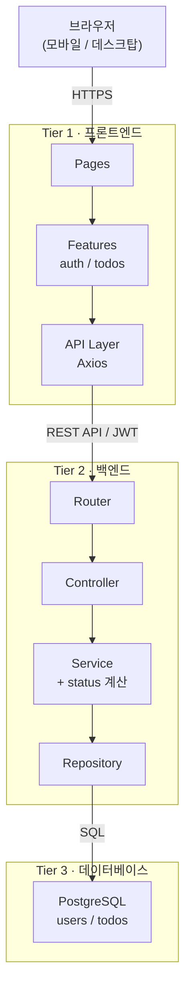
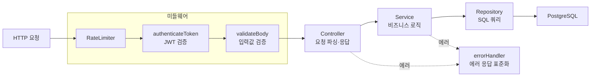
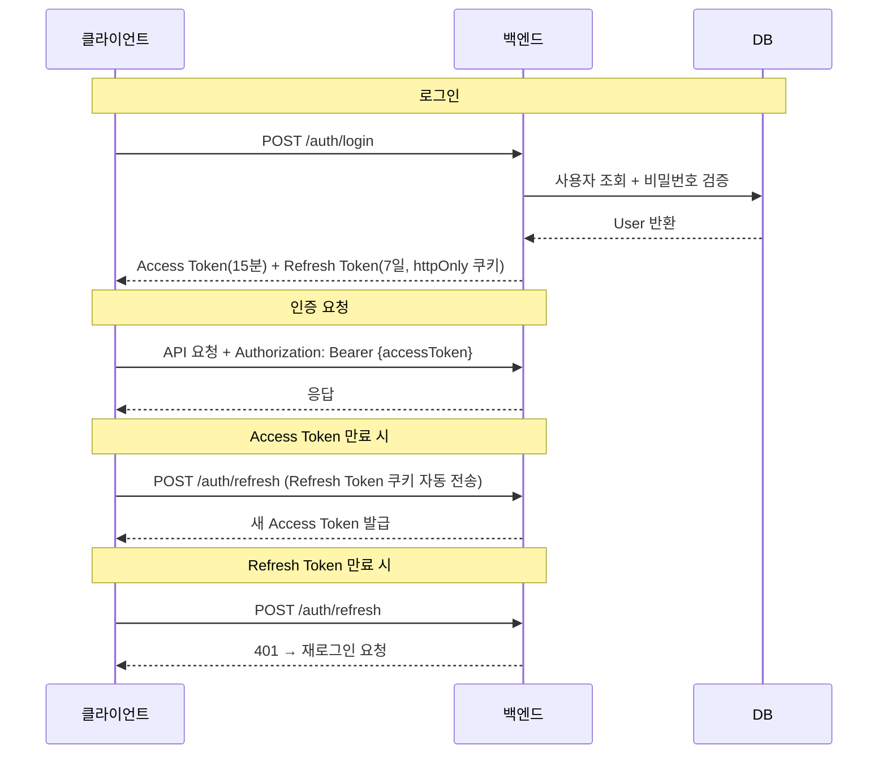
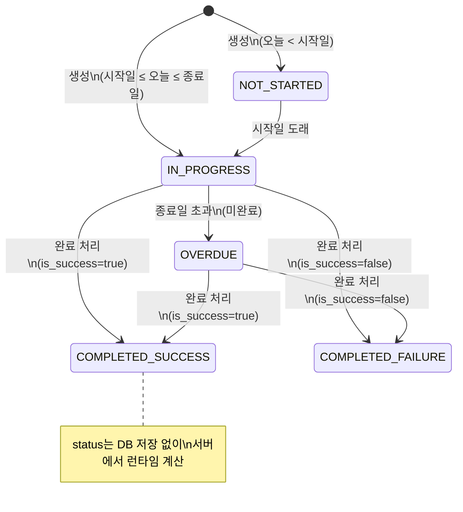
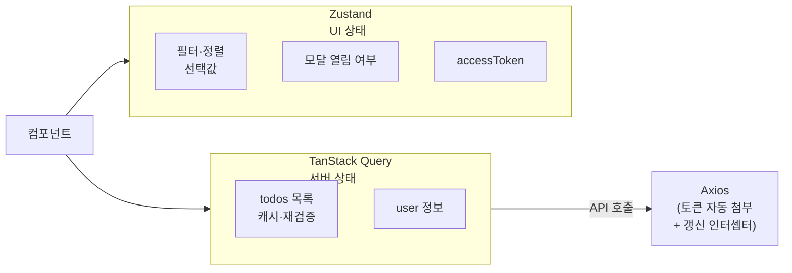
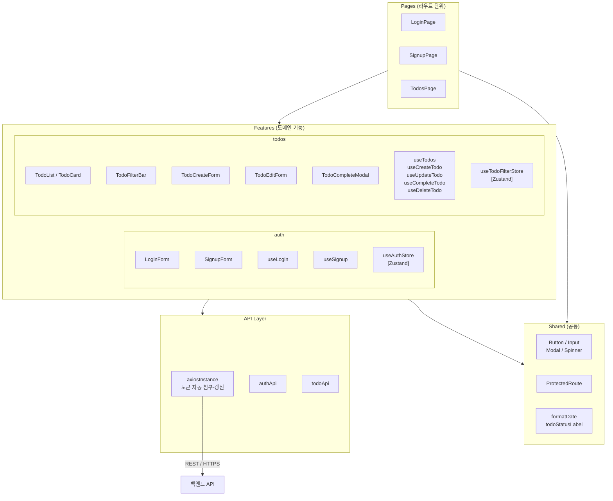

# 기술 아키텍처 다이어그램

**프로젝트명:** todolist-app
**문서 버전:** v0.1
**작성일:** 2026-04-01
**작성자:** Yongwoo

---

## 1. 전체 시스템 구조 (3-Tier)

---

## 2. 백엔드 레이어 및 미들웨어

---

## 3. 인증 흐름 (JWT)

---

## 4. 할일 상태 전이

---

## 5. 프론트엔드 상태 관리

---

## 6. 프론트엔드 레이어 구조

---

## 변경 이력

| 버전 | 변경일 | 변경자 | 변경 내용 |
|------|--------|--------|-----------|
| v0.1 | 2026-04-01 | Yongwoo | 최초 작성: 시스템 구조, 백엔드 레이어, 인증 흐름, 상태 전이, 프론트엔드 상태 관리 |
| v0.2 | 2026-04-01 | Yongwoo | ERD(§6), 프론트엔드 레이어 구조(§7) 추가 |
| v0.3 | 2026-04-01 | Yongwoo | ERD 항목 제거 (6-erd.md로 분리) |
