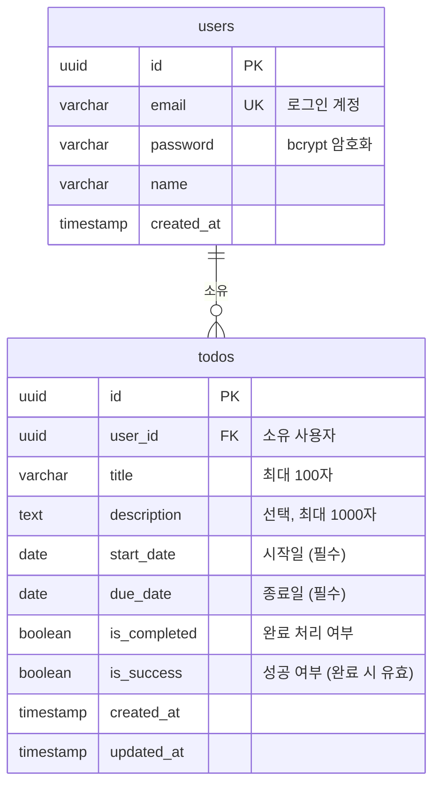

# ERD (Entity Relationship Diagram)

**프로젝트명:** todolist-app
**문서 버전:** v0.1
**작성일:** 2026-04-01
**작성자:** Yongwoo

---

> `status` 컬럼은 DB에 저장하지 않는다.  
> `start_date`, `due_date`, `is_completed`, `is_success` 값으로 서버에서 런타임 계산한다.

---

## 변경 이력

| 버전 | 변경일 | 변경자 | 변경 내용 |
|------|--------|--------|-----------|
| v0.1 | 2026-04-01 | Yongwoo | 최초 작성 |
